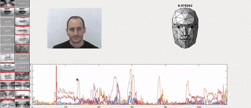

# AU Player
A simple Action Unit player with a rendered face modeled with Candide-3.  
The tool permits to plot [Action Units](https://www.cs.cmu.edu/~face/facs.htm) values on a temporal basis and convert them in terms of AUV from the [Candide-3](http://www.icg.isy.liu.se/candide/) model, in order to show a 113-vertex based expression face.

### Demo

### Credits
**AU Player** is a [PHuSe Lab](http://phuselab.di.unimi.it/) project, from Università degli Studi di Milano.
- Giuseppe Boccignone <giuseppe.boccignone@unimi.it>
- Vittorio Cuculo <vittorio.cuculo@unimi.it>
- Raffaella Lanzarotti <lanzarotti@di.unimi.it>
